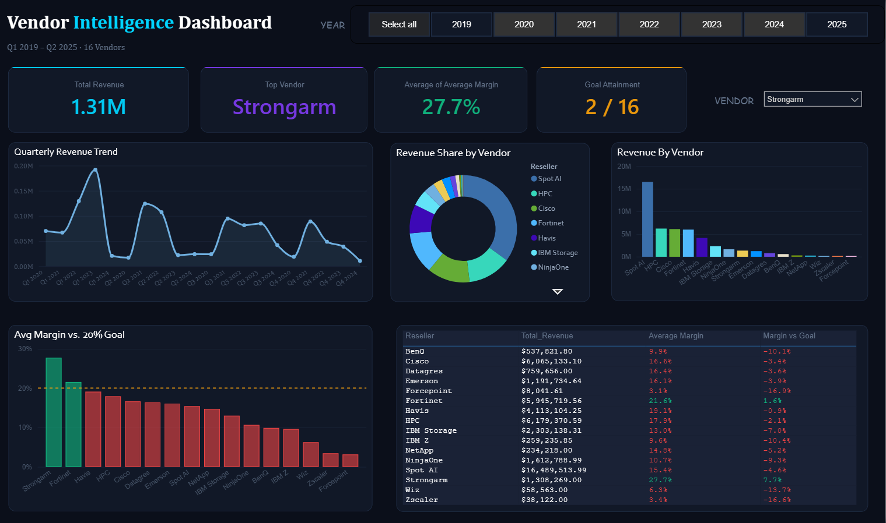
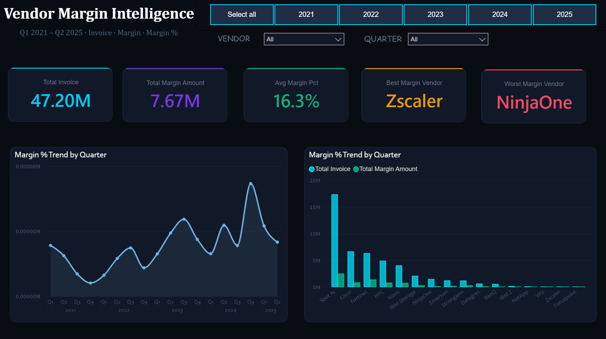

# Vendor Intelligence Dashboard — Power BI

**Tools:** Power BI Desktop · DAX · Power Query · Star Schema · Excel  
**Program:** Build Fellowship by Open Avenues  
**Duration:** 2025

---

## Business Problem

A vendor portfolio generating $52M+ in revenue had no clear visibility into which vendors were actually profitable. Leadership needed an interactive reporting solution to answer:

- Which vendors are generating the most revenue?
- Which vendors are meeting the 20% margin goal?
- How have revenue and margin trended over 6 years?
- Where are the biggest opportunities for margin improvement?

---

## What I Built

Two fully interactive Power BI dashboards covering 16 vendors across Q1 2019 – Q2 2025.

### Dashboard 1 — Vendor Intelligence (Revenue View)
- KPI Cards: Total Revenue, Top Vendor, Avg Margin %, Goal Attainment
- Quarterly revenue trend across 26 quarters
- Revenue share by vendor (donut) + ranked bar chart
- Avg Margin vs 20% goal with conditional formatting
- Vendor scorecard table with revenue, margin, and goal status
- Year and vendor slicers for dynamic filtering

### Dashboard 2 — Vendor Margin Intelligence
- KPI Cards: Total Invoice, Total Margin, Avg Margin %, Best/Worst Vendor
- Margin % trend by quarter
- Invoice vs Margin $ comparison by vendor
- Stacked margin $ by year per vendor
- Detailed margin scorecard with best quarter per vendor

---

## Key Insights

| Finding | Detail |
|---|---|
| Goal attainment | Only **2 of 16 vendors** consistently meet the 20% margin goal |
| Top revenue vendor | **Spot AI** — $17.4M revenue but only 15.4% margin |
| Best margin vendor | **Strongarm** — 27.7% margin, portfolio benchmark |
| Biggest anomaly | **Cisco Q4 2024** — $2.4M invoiced at only 6.1% margin |
| Portfolio average | **13.8%** — significantly below the 20% target |

---

## Business Recommendations

1. **Renegotiate Spot AI pricing** — a 5% margin improvement adds ~$870K in annual profit
2. **Protect Strongarm & Fortinet** — only consistent above-goal vendors; lock in long-term contracts
3. **Investigate Cisco Q4 2024** — worst single-quarter performance in the dataset
4. **Review Zscaler, Forcepoint, Wiz** — minimal revenue + sub-5% margins; evaluate ROI
5. **Implement quarterly margin reviews** — structured path to reach the 20% portfolio goal

---

## Data Model

- Star Schema with fact table + VendorList dimension table
- Data cleaned in Power Query: removed duplicates, unpivoted quarterly columns, standardized formats
- DAX measures: Total Revenue, Avg Margin %, Goal Attainment, Best/Worst Vendor

---

## Dashboard Preview

### Dashboard 1 — Vendor Intelligence

### Dashboard 2 — Vendor Margin Intelligence

---

## How to Use

1. Download the `.pbix` file
2. Open in Power BI Desktop
3. Use Year, Vendor, and Quarter slicers to filter dynamically
4. Navigate between dashboards for revenue vs margin views
